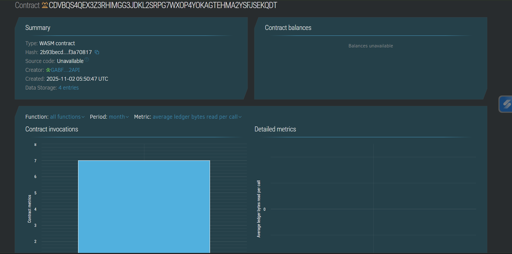

# Token-Gated Content Access (Stellar Soroban + Freighter)

A minimal **token-gated access** system built on **Stellar Soroban smart contracts**.  
Only users with valid access (granted via contract or token ownership) can view gated content.  
Wallet authentication and contract interaction are handled via **Freighter Wallet** and **Soroban CLI**.

📄 Smart Contract Details
Contract Name: access_contract
Language: Rust (Soroban)
Network: Stellar Testnet
Contract ID: CDVBQS4QEX3Z3RHIMGG3JDKL2SRPG7WXOP4YOKAGTEHMA2YSFJSEKQDT


## 🧩 Project Structure
```

token-gated-content-access/
│
├── access_contract/          # Soroban contract (WASM + deployment commands)
├── backend/                  # Node.js backend server
│   └── index.js              # Executes Soroban CLI commands via REST API
├── frontend/                 # React frontend (Vite)
│   ├── src/
│   │   ├── Home.jsx          # Wallet connect + access check
│   │   ├── Dashboard.jsx     # Protected content
│   │   ├── NoAccess.jsx      # Fallback screen for denied users
│   │   └── App.jsx           # Routing setup
│   └── package.json
└── README.md

```
## ⚙️ Prerequisites

1. **Node.js** (>=18)
2. **Soroban CLI** installed  
   ```
   cargo install --locked soroban-cli
   ```

3. **Freighter Wallet** browser extension
4. **Testnet Account** created at [https://laboratory.stellar.org/#account-creator?network=test](https://laboratory.stellar.org/#account-creator?network=test)
5. **WASM Contract deployed** on Stellar Testnet
   Example contract ID:

   ```
   CDVBQS4QEX3Z3RHIMGG3JDKL2SRPG7WXOP4YOKAGTEHMA2YSFJSEKQDT
   ```

## 🚀 Setup Instructions

### 1. Clone Repository

```
git clone https://github.com/shreya-024/token-gated-content-access.git
cd token-gated-content-access
```

### 2. Configure Environment

Create `.env` in `backend/`:

```
PORT=5000
```

Ensure your Soroban CLI has an **admin identity**:

```
soroban keys generate admin
soroban keys ls
```

## 🖥️ Backend Setup

Go to backend directory:

```
cd backend
npm install
```

Edit `index.js` if needed:

```js
const CONTRACT_ID = "CDVBQS4QEX3Z3RHIMGG3JDKL2SRPG7WXOP4YOKAGTEHMA2YSFJSEKQDT";
```

Start backend:

```
node index.js
```

Expected output:

```
Backend running on port 5000
```


## 🌐 Frontend Setup

Go to frontend directory:

```
cd ../frontend
npm install
npm run dev
```

Access frontend at:

```
http://localhost:5173/
```


## 🔐 How It Works

1. User clicks **Connect Freighter Wallet**.
2. Frontend requests wallet address via Freighter API.
3. Sends request to backend:

   ```
   GET /api/has-access/:address
   ```
4. Backend runs Soroban CLI:

   ```bash
   soroban contract invoke \
   --id <CONTRACT_ID> \
   --source admin \
   --network-passphrase "Test SDF Network ; September 2015" \
   --rpc-url https://soroban-testnet.stellar.org \
   -- has_access --who <address>
   ```
5. Returns `true` or `false` — frontend navigates to `/dashboard` or `/no-access`.


## 🧾 Admin Commands

Grant access:

```bash
soroban contract invoke \
  --id <CONTRACT_ID> \
  --source admin \
  --network-passphrase "Test SDF Network ; September 2015" \
  --rpc-url https://soroban-testnet.stellar.org \
  -- grant --who <USER_ADDRESS> --send=yes
```

Revoke access:

```bash
soroban contract invoke \
  --id <CONTRACT_ID> \
  --source admin \
  --network-passphrase "Test SDF Network ; September 2015" \
  --rpc-url https://soroban-testnet.stellar.org \
  -- revoke --who <USER_ADDRESS> --send=yes
```

Check access:

```bash
soroban contract invoke \
  --id <CONTRACT_ID> \
  --source admin \
  --network-passphrase "Test SDF Network ; September 2015" \
  --rpc-url https://soroban-testnet.stellar.org \
  -- has_access --who <USER_ADDRESS>
```


## 🧪 Testing with Multiple Wallets

1. Open the site in **Browser A** (admin Freighter wallet).
2. Grant access to another wallet (Browser B).
3. Open the site in **Browser B** (second Freighter wallet).
4. Click **Connect Freighter Wallet** → it will navigate to:

   * ✅ `/dashboard` → if access granted
   * ❌ `/no-access` → if access denied


## 🧰 Troubleshooting

| Issue                                         | Cause                  | Fix                                       |
| --------------------------------------------- | ---------------------- | ----------------------------------------- |
| `error: unrecognized subcommand 'balance_of'` | Wrong contract command | Use `has_access`, not `balance_of`        |
| `404 RPC error`                               | Wrong `--rpc-url`      | Use `https://soroban-testnet.stellar.org` |
| Access denied even after grant                | Forgot `--send=yes`    | Add `--send=yes` for state-changing calls |
| Freighter not connecting                      | Wrong network          | Set Freighter to **TESTNET**              |


## 🪙 Future Extensions

* Replace manual grant/revoke with **token ownership check** (`balance_of` from token contract).
* Integrate Stellar Horizon API for asset-based access control.
* Deploy backend to cloud and host frontend on Vercel/Netlify.




